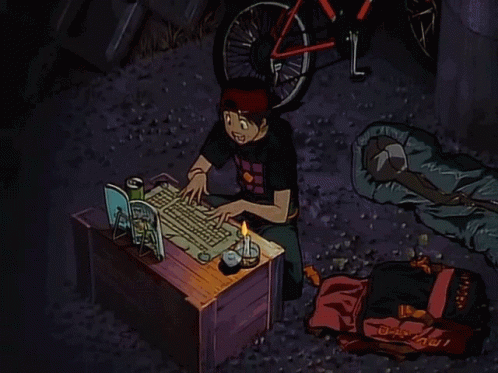

<h1 align="center">Yo! Zuhair here!!</h1>
<h3 align="center">
  
</h3>
<!-- 
  
 -->

  

 <a href="https://youtu.be/RvIx-SJvlNY" target="blank">   

  

    

   
   

- 📝 Sometimes I write on my [Blog](https://blog.zuhair.tech/)

- 📫 How to reach me **tarif4667@gmail.com**

- 📄 Know about my experiences on [Portfolio](https://zuhair.is-a.dev/)

- ⚡ Fun fact **I think I am funny**
   
- 🎮 I play **ESports**  sometimes
  

<h3 align="left">Connect with me:</h3>

<h3 align="left">Languages and Tools:</h3>

              

<h2>GitHub Stats</h2>

  
  
 

  

